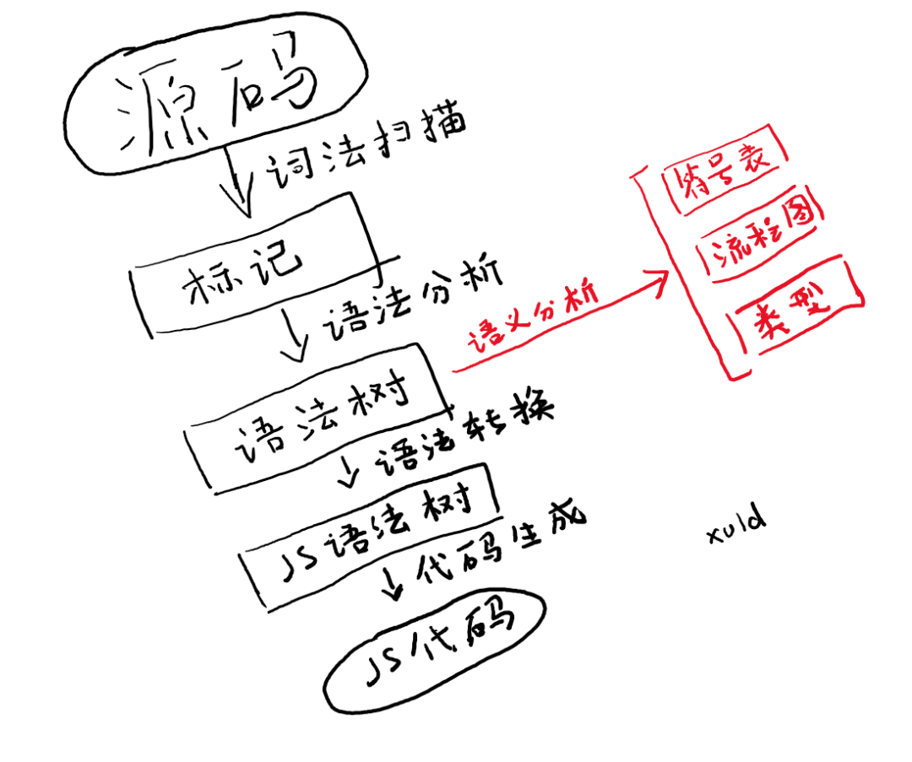
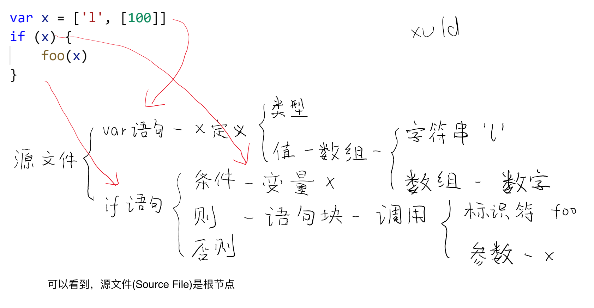

# TypeScript

[](https://travis-ci.org/microsoft/TypeScript)
[](https://dev.azure.com/typescript/TypeScript/_build?definitionId=7)
[](https://www.npmjs.com/package/typescript)
[](https://www.npmjs.com/package/typescript)


## Goal
1. Compatible with all JavaScript syntax, and extend the syntax based on JS;
2. Statically analyze the code to find the code that is likely to have BUG;
3. Generate pure JavaScript code without any optimization or processing of the code, **even errors in the source code are retained in the generated code**;
3. **Does not affect the runtime environment of the generated code**.


## Project structure
```
├── bin                # the final tsc and tsserver commands for users
├── doc                # language specification document
├── lib                # system standard library and localization of prompt information, LKG
├── loc
│ └── lcl              # error message localization
├── scripts            # tool scripts when developing projects
├── src                # source code
│ ├── compiler         # compiler source code
│ │ ├── transformers   # transformers with different target syntax
│ │ ├── scanner.ts     # grammar analysis: scan a single file, lexical analysis
│ │ ├── parser.ts      # grammar analysis: get tokens to generate AST tree, syntax analysis
│ │ ├── binder.ts      # semantic analysis: analysis scope, create symbol table; analysis process, create flow diagram
│ │ ├── checker.ts     # semantic analysis: type checking, do semantic analysis
│ │ ├── transformer.ts # optimization generation: syntax conversion and polyfill
│ │ ├── emitter.ts     # optimization generation: JS code generation
│ │ ├── system.ts      # tools: OE
│ │ └── types.ts       # tools: key data structures and interfaces
│ └── services         # language service, mainly used by VSCode. Searching for definitions and other functions
└── tests              # test
```





See: [More Details](./Details.md)

## More Info

*  [microsoft/TypeScript/README](https://github.com/microsoft/TypeScript/blob/master/README.md)
*  [TypeScript 源码详细解读](https://www.cnblogs.com/xuld/p/12180913.html)
*  [TypeScript Deep Dive](https://basarat.gitbook.io/typescript/)

## Contribute

There are many ways to [contribute](https://github.com/microsoft/TypeScript/blob/master/CONTRIBUTING.md) to TypeScript.
* [Submit bugs](https://github.com/microsoft/TypeScript/issues) and help us verify fixes as they are checked in.
* Review the [source code changes](https://github.com/microsoft/TypeScript/pulls).
* Engage with other TypeScript users and developers on [StackOverflow](https://stackoverflow.com/questions/tagged/typescript).
* Help each other in the [TypeScript Community Discord](https://discord.gg/typescript).
* Join the [#typescript](https://twitter.com/search?q=%23TypeScript) discussion on Twitter.
* [Contribute bug fixes](https://github.com/microsoft/TypeScript/blob/master/CONTRIBUTING.md).
* Read the language specification ([docx](https://github.com/microsoft/TypeScript/blob/master/doc/TypeScript%20Language%20Specification.docx?raw=true),
 [pdf](https://github.com/microsoft/TypeScript/blob/master/doc/TypeScript%20Language%20Specification.pdf?raw=true), [md](https://github.com/microsoft/TypeScript/blob/master/doc/spec.md)).

This project has adopted the [Microsoft Open Source Code of Conduct](https://opensource.microsoft.com/codeofconduct/). For more information see
the [Code of Conduct FAQ](https://opensource.microsoft.com/codeofconduct/faq/) or contact [opencode@microsoft.com](mailto:opencode@microsoft.com)
with any additional questions or comments.


## Building

In order to build the TypeScript compiler, ensure that you have [Git](https://git-scm.com/downloads) and [Node.js](https://nodejs.org/) installed.

Clone a copy of the repo:

```bash
git clone https://github.com/microsoft/TypeScript.git
```

Change to the TypeScript directory:

```bash
cd TypeScript
```

Install [Gulp](https://gulpjs.com/) tools and dev dependencies:

```bash
npm install -g gulp
npm install
```

Use one of the following to build and test:

```
gulp local             # Build the compiler into built/local.
gulp clean             # Delete the built compiler.
gulp LKG               # Replace the last known good with the built one.
                       # Bootstrapping step to be executed when the built compiler reaches a stable state.
gulp tests             # Build the test infrastructure using the built compiler.
gulp runtests          # Run tests using the built compiler and test infrastructure.
                       # Some low-value tests are skipped when not on a CI machine - you can use the
                       # --skipPercent=0 command to override this behavior and run all tests locally.
                       # You can override the specific suite runner used or specify a test for this command.
                       # Use --tests=<testPath> for a specific test and/or --runner=<runnerName> for a specific suite.
                       # Valid runners include conformance, compiler, fourslash, project, user, and docker
                       # The user and docker runners are extended test suite runners - the user runner
                       # works on disk in the tests/cases/user directory, while the docker runner works in containers.
                       # You'll need to have the docker executable in your system path for the docker runner to work.
gulp runtests-parallel # Like runtests, but split across multiple threads. Uses a number of threads equal to the system
                       # core count by default. Use --workers=<number> to adjust this.
gulp baseline-accept   # This replaces the baseline test results with the results obtained from gulp runtests.
gulp lint              # Runs eslint on the TypeScript source.
gulp help              # List the above commands.
```


## Usage

```bash
node built/local/tsc.js hello.ts
```
